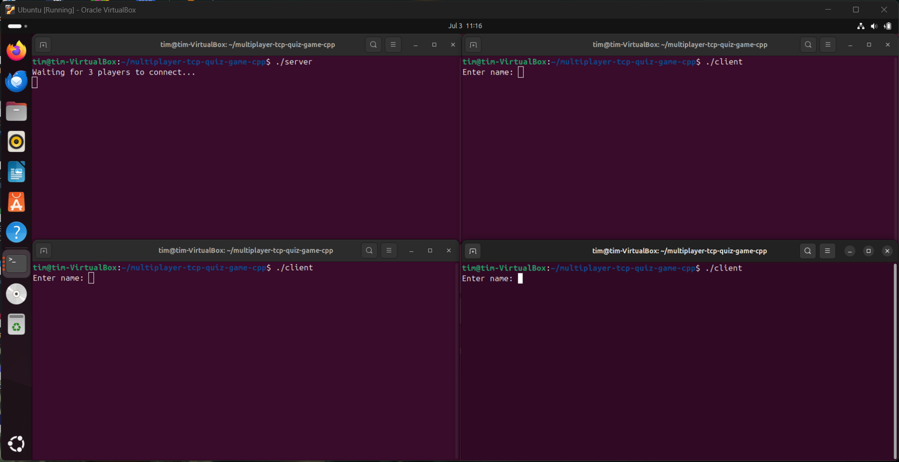
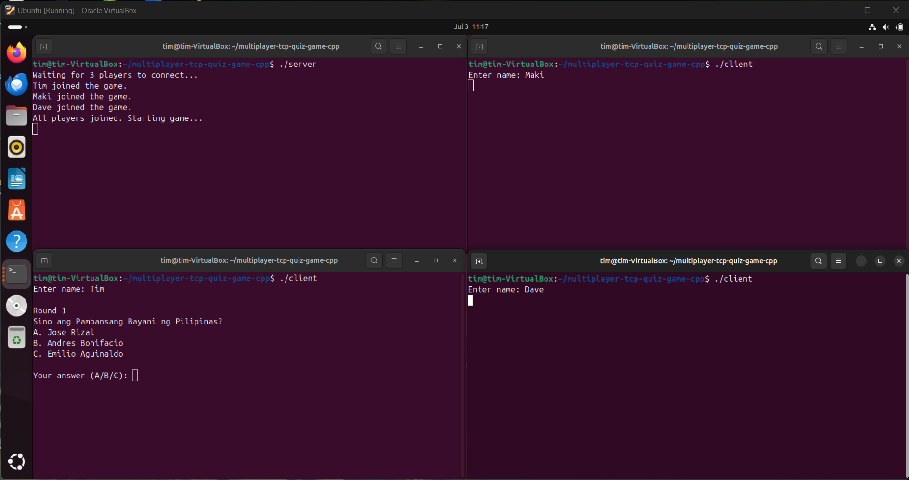
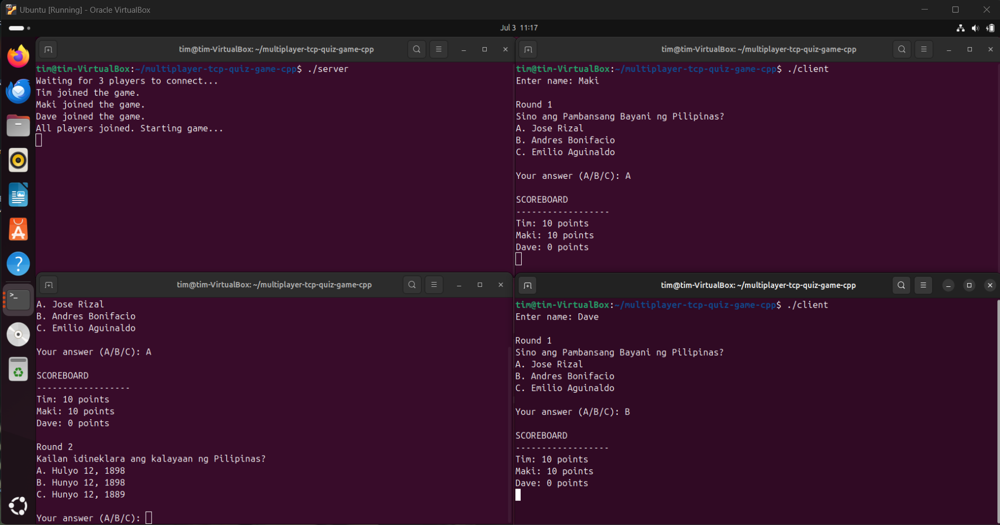
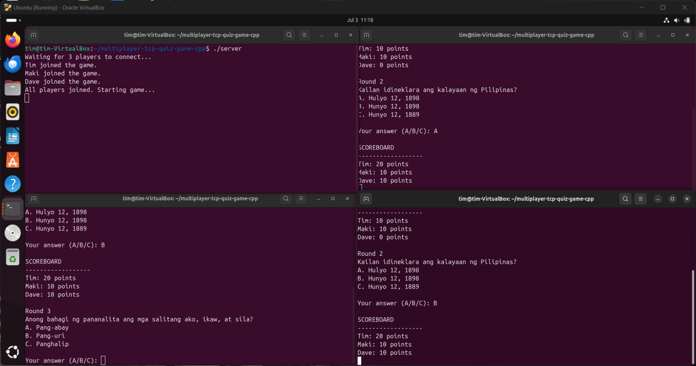
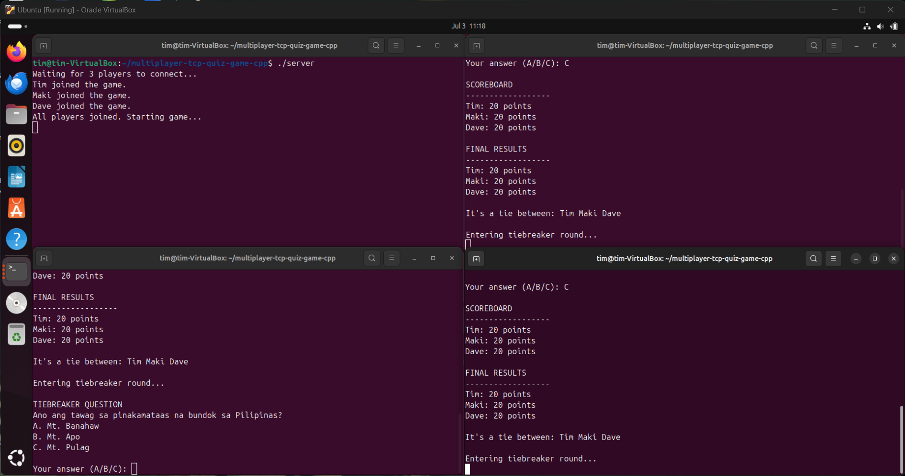
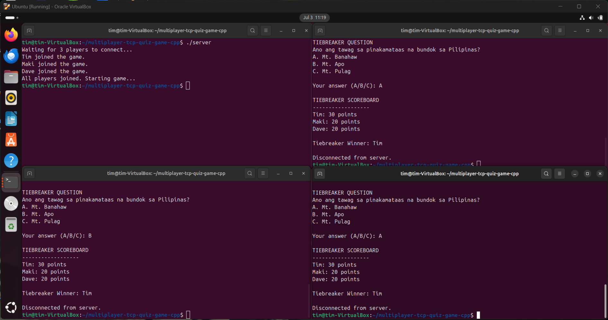

# Multiplayer TCP Quiz Game in C++

A C++ client-server quiz game that allows multiple players to connect through TCP sockets and compete in a real-time console-based quiz.

This project demonstrates socket programming, multithreading, mutex-protected shared state, scoring logic, and tiebreaker handling using a server-client architecture.

## Features

- TCP socket-based client-server communication
- Supports 3 connected players
- Multithreaded player connection handling
- Mutex-protected shared player list
- Multiple-choice quiz questions
- Real-time score updates
- Final results display
- Tiebreaker round for tied players
- Console-based server and client programs

## Technologies Used

- C++
- C++17
- POSIX sockets
- TCP/IP networking
- Threads
- Mutex
- Ubuntu/Linux terminal
- Oracle VirtualBox
- Git and GitHub

## Project Structure

```text
multiplayer-tcp-quiz-game-cpp/
├── .gitignore
├── README.md
├── assets/
│   ├── sample-output.png
│   ├── sample-output2.png
│   ├── sample-output3.png
│   ├── sample-output4.png
│   ├── sample-output5.png
│   └── sample-output6.png
├── client.cpp
└── server.cpp
```

## How to Run

> Note: This project uses POSIX socket headers such as `<sys/socket.h>`, `<netinet/in.h>`, `<arpa/inet.h>`, and `<unistd.h>`.  
> Run this project on Linux, macOS, WSL, or an Ubuntu virtual machine.

### Ubuntu/Linux

1. Clone the repository:

```bash
git clone https://github.com/TimNieto/multiplayer-tcp-quiz-game-cpp.git
```

2. Go to the project folder:

```bash
cd multiplayer-tcp-quiz-game-cpp
```

3. Compile the server and client:

```bash
g++ server.cpp -o server -pthread
g++ client.cpp -o client
```

4. Run the server in one terminal:

```bash
./server
```

5. Open three more terminals and run one client in each terminal:

```bash
cd multiplayer-tcp-quiz-game-cpp
./client
```

6. Enter a player name in each client window and answer the quiz questions.

## Sample Output

### Server Waiting for Players



### Players Joined and Round 1 Started



### Round 1 Scoreboard and Round 2 Question



### Round 2 Scoreboard and Round 3 Question



### Final Tie Result and Tiebreaker Start



### Tiebreaker Scoreboard and Winner



## Networking Notes

The server listens on port `12345`.

The client connects to:

```text
127.0.0.1
```

For the easiest test, run the server and all client terminals on the same machine or inside the same Ubuntu virtual machine.

## Concepts Used

- TCP socket programming
- Server-client architecture
- Multithreading
- Mutex synchronization
- Shared state management
- Structs
- Vectors
- Maps
- Input validation
- Score calculation
- Tiebreaker logic

## Future Improvements

- Allow a custom number of players
- Add configurable server IP and port
- Add more quiz categories
- Randomize question order
- Add timer-based answering
- Improve client disconnect handling
- Add a GUI or web-based client

## License

This project is for educational and portfolio purposes only. All rights are reserved.

You may view the source code, but you may not copy, modify, distribute, or use this code without permission from the author.

## Author

Created by Tim Nieto.